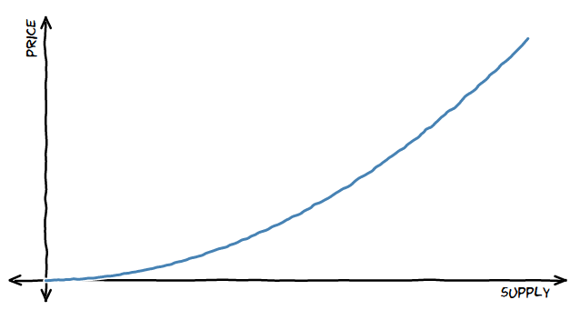

## A Technical Introduction to Bonding Curves
### For beginners

---
## Who is this for?
* An overview of the technical landscape of bonding curves, for beginners
* Providing context for deeper exploration

---
## Basic Properties
* A function of (at least) token price and supply
* Monotonically increasing
* Deterministic

---
## Misconceptions
* Bonding curves are ponzi schemes
* Bonding curves are for funding 
(I've heard this questions numerous times, thanks for addressing it in your talk!!
Similar:
* Bonding curves are for exchanges only
* Bonding curves eliminate speculation)

---
## Terminology

--
## Invariant:
> a property or relationship that remains constant e.g. reserve ratio

--
## Reserve ratio:
> the ratio of the token reserve to token market cap. at a point

``$$
\text{Reserve ratio} = \frac{R}{S*P}
$$``

where R is the reserve, S is the supply, and P is the spot price.

--
* Market cap: market capitalization
* Price sensitivity: the proportionate effect of each token transaction on the spot price
* Collateral: the token held in the reserve
* Reserve: the store of value backing the token supply
* Supply: the tokens issued in exchange for reserve collateral
* Spot price: the token value at a point
* Primitive function: the function describing the relationship between the token price and supply
* Leverage ratio
* Slippage
* Vesting
* Market maker
* Price discovery
* TCR: token curated registry
* Continuous fundraising

---
## A Design Canvas

---
## Design Parameters
* Time
* Issuance e.g. ERC20, ERC721
* Supply
* Collateral
* Function
* Pricing
* Composition e.g. piecewise

---
## Patterns and Classification

--
## Static vs. Dynamic

---
## Modelling & Simulations
* Testing robustness
* Finding edge cases
* Performing sensitivity analysis
* Defining system bounds

--
## Actor model

--
## Incentive design

--
## cadCAD framework

---
## Limitations

--
## Solidity & EVM
* Implementing integrals and inverse integrals of higher order functions becomes challenging
* Staying within limits of int256 overflows and underflows
* Handling front running of transactions
* Batched processing of transactions within single block - can't guarrantee spot price without slippage

---
## In the wild...
* Coordination mechanisms
* Interfaces
* Configuration spaces
* Funding mechanisms
* Voting
* Composability
* Community currencies & micro-economies

--
## Bancor

--
## Uniswap
(you might also address the question why Uniswap has become so much more popular than Bancor. A matter of the curve design? PR?)

--
## Molecule

--
## SourceCred

--
## Balancer

--
## IXO Impact Bonds

---
## Trends
* Application of engineering methodology
* Introducing more degrees of freedom (e.g. risk-adjusted bonding curves)
* Introducing time as a variable (e.g. conviction voting)
* Using bonding curves as system interfaces (e.g. commons stack)
* Composability of bonding curves within modular systems

---
## Resources
* www.tokenengineering.org (pls note: we've launched a new website!)
* https://community.cadcad.org
* This presentation! https://tokenengineeringcommunity.github.io/intro-to-bonding-curves/
