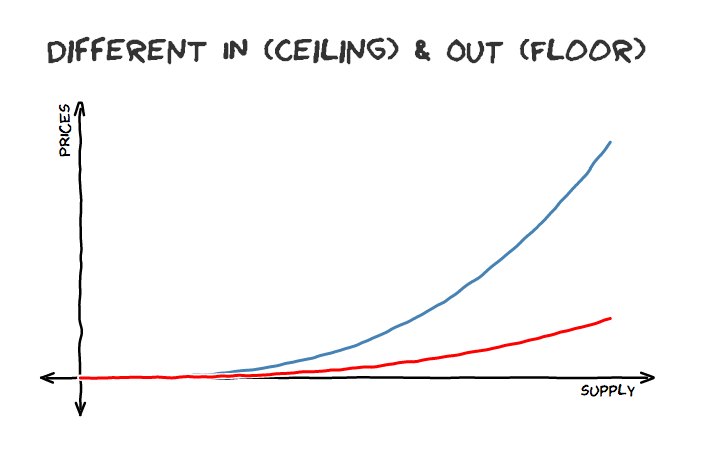

---
## A Design Canvas

---
## Design Parameters
* Time
* Issuance e.g. ERC20, ERC721
* Supply
* Collateral
* Function
* Pricing
* Composition e.g. piecewise

--
## Pricing 

  

  

  <!-- more Elements -->

Source https://medium.com/@simondlr
