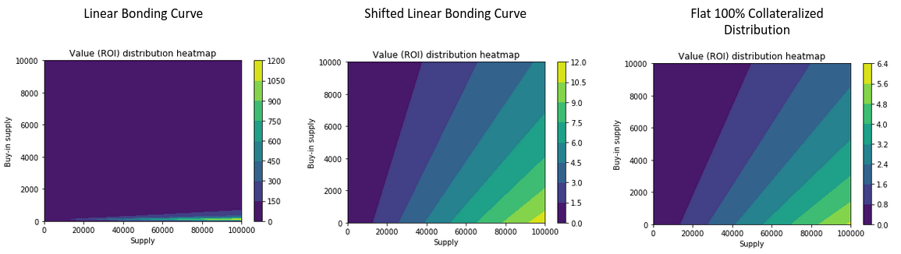

# Automated market makers & liquidity providers
> Are they bonding curves?

--
* Uniswap, Bancor, and Balancer all describe mathematical relationships between two or more token pools.
* They share some of the same properties.
* All bonding mechanisms, define a mathematical pricing relationship with some form of invariant.

--
## Uniswap
> An "Automated Liquidity Provider"
* Defines a constant product relationship between the reserve of two ERC20 token pools.

``$$
x*y = k
$$``

`x` and `y` are the reserve balance in a token pair, and k is the **invariant**!

See https://uniswap.org/docs/v2/

Note:
* Is Uniswap a bonding curve? Not in a strict sense.
* Does it share some of the same properties? Yes.
* larger trades (relative to reserves) execute at exponentially worse rates than smaller ones
* Uniswap applies a trade fee, which increases k, and pays out liquidity providers
* arbitrage acts to rebalance

--

Source:  Markus Koch, BlockScience - https://youtu.be/d-YfF-xNuz4

--
## Bancor
> Always available, constant liquidity source
* Defines liquidity pools with one or more token reserves, price adjusted to maintain reserve ratio

``$$
Price = \frac{\text{Reserve balance}}{\text{Token supply} * \text{Reserve ratio}}
$$``

Note:
* traditionally the role of order book matching
* Reserve ratio is the...? Invariant.

--
## Balancer
> Balancer is a non-custodial portfolio manager, liquidity provider, and price sensor

--
> "generalization of the constant product rule, allowing for 2 or more tokens as well as the choice of arbitrary value weights for each token. The weights represent the share of value each token represents in the total pool value."

* Extends on ideas implemented by Uniswap
* It adds another dimension
* 2 or more token pools, intended as a portfolio balancer

See https://docs.balancer.finance/protocol/background

---

# Limitations

--
## Solidity & EVM
* Implementing integrals and inverse integrals of higher order functions becomes challenging

* Staying within limits of int256 overflows and underflows

* Handling front running of transactions

* Batched processing of transactions within single block - can't guarrantee spot price without slippage

--
## Complex systems

> Complex systems — highly connected networks of semi-independent agents from which system wide patterns emerge—that can learn and adapt over time.
<!-- * Human social systems … capable of independent spontaneous, self-organization. -->
<!-- * Agents whose interactions result in self-organization, emergence, and adaptation. -->

(more on this later, I'm sure!)

Source: https://www.mdpi.com/2079-8954/7/1/4/htm

---
# Modelling & Simulation

--
* Bringing engineering practise to token engineering.
* An iterative design cycle.

> Design informs development.

Source: Michael Zargham, BlockScience

--
## Why?
* Design and algorithm validation
* Testing robustness
* Finding edge cases
* Performing sensitivity analysis
* Defining system bounds

--
Some edge cases are more obvious than others, modelling (if done well), covers all your bases.

Source: https://alistapart.com/article/avoidedgecases/

--
## How?
* Actor modelling
* cadCAD framework

> a Python package that assists in the processes of designing, testing and validating complex systems through simulation, with support for Monte Carlo methods, A/B testing and parameter sweeping

--
For example, running an experiment multiple times with different parameters.

---
## In the wild...
> Bonding curves have become core to many token engineering systems.

* Coordination mechanisms
* System interfaces
* Configuration spaces
* Funding mechanisms
* Voting
* Community currencies & micro-economies

<!-- --
* Commons Stack conviction voting
* Molecule markets
* SourceCred
* IXO Impact Bonds -->

---
## Trends
* Application of engineering methodology

* Introducing more degrees of freedom (e.g. risk-adjusted bonding curves)

* Introducing time as a variable (e.g. conviction voting)

* Using bonding curves as modular system interfaces (e.g. commons stack)

Note:
* Composability of bonding curves within modular systems

---
## Contributions
* Angela Kreitenweis @akrtws (GitHub), founding member of TE global community

---
## Resources
* www.tokenengineering.org
* https://community.cadcad.org

* This presentation is on GitHub, alongside other useful resources! https://tokenengineeringcommunity.github.io/intro-to-bonding-curves/

* Feeling brave? Extended version (i.e the "rough draft") https://intro-to-bonding-curves-extended.netlify.app

* Questions? @benscholtz (Twitter) & @benschza (GitHub)
