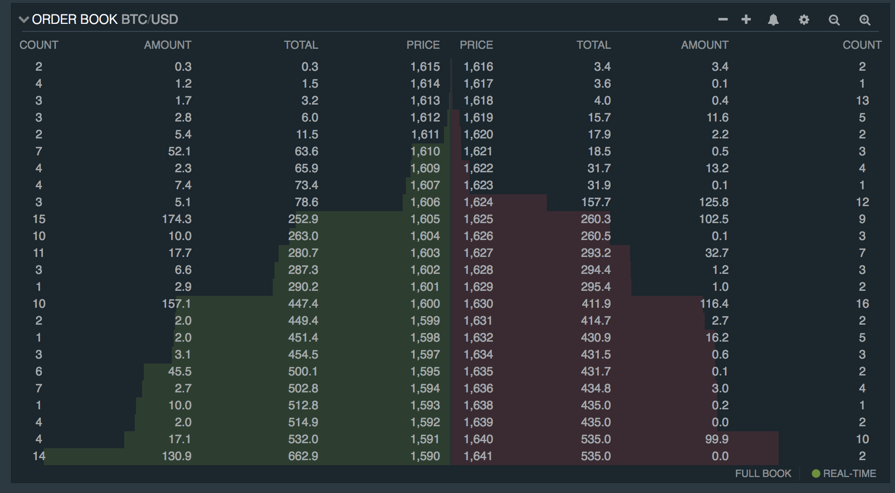
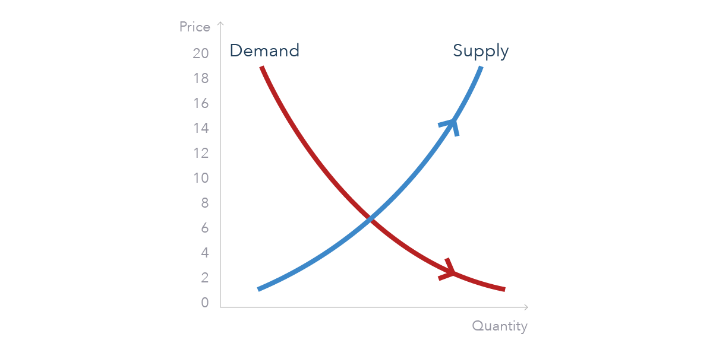

## A Technical Introduction to Bonding Curves
### For beginners

---
## Who is this for?
* An overview of the technical landscape of bonding curves, for beginners
* Providing context for deeper exploration

---
## Basic Properties
* A function of (at least) token price and supply
* Monotonically increasing
* Deterministic

(We will see variations and extensions of these basic properties, but this is where it all started.)

--

---
## Misconceptions
* Bonding curves are ponzi schemes
* Bonding curves are for funding, exchanges, & eliminate speculation
* Uniswap is a bonding curve

---
# Background

--
## Scarcity in the digital domain
* Blockchain enables the concept of scarcity
* Solves the double spending problem
* Becomes a source of truth, enables the concept of ownership
* Classic example: apple vs. digital image of apple

--
## Liquidity & microeconomics

Source: https://bitcoin.stackexchange.com

--
* Balance of liquidity and risk; market makers and market takers
* An order book provides liquidity; willing seller & willing buyer
* Dependent on trade volumes

--
## Price discovery

Source: https://www.ig.com/en/trading-strategies/what-is-price-discovery-and-how-does-it-work--190605

--
* Producer and consumer reach an equilibrium
* With some price elasticity
* Bonding curves can be a primitive price discovery mechanism

---
# Terminology

--
## Collateral and reserve
> Collateral is the token backing the reserve;
> reserve is the store of value backing the token supply.

--
## Market cap. (market capitalization)
> Share price multiplied by the number of shares outstanding.
* Or... spot price multiplied by total token supply.

--
## Supply
> The tokens issued in exchange for reserve collateral.

--
## Primitive function
> The function describing the relationship between the token price and supply.

--
## Spot price
> The value of a single token at a point along a curve.

--
## Reserve ratio
> The ratio of the token reserve to token market cap. at a point.

``$$
\text{Reserve ratio} = \frac{R}{S*P}
$$``

where R is the reserve, S is the supply, and P is the spot price.

--
## Invariant
> A property or relationship that remains constant e.g. reserve ratio.

--
## Slippage & price sensitivity
> The proportionate effect of each token transaction on the spot price.
* Given a spot price and a number of tokens transacted, what is the percentage *slippage* from market value?

--
## Leverage ratio
> The ratio of market cap. and the underlying reserve collateral.
* The higher the leverage ratio, the higher the price sensitivity, and the higher the slippage.

--
## Liquidity
> The availability of liquid assets for transactions and trade.

--
## Market maker
> A mechanism or actor that creates liquidity, by providing collateral in exchange for a given token.
* Coming up: Automated Market Makers

(in the case of a traditional order book, this definition is different, and involves giving both a buy and sell price for an asset - making a profit on the spread)

--
## Price discovery
> The price discovery process is the process of determining the price of an asset in the marketplace through the interactions of buyers and sellers.
* The same holds true for bonding curve mechanisms, in a less organic, more deterministic manner.

---
# Automated market makers & liquidity providers
> Are they bonding curves?

--
## Bancor
* Traditionally the role of order book matching
* Defines liquidity pools with one or more token reserves, price adjusted to maintain reserve ratio
* Always available, constant liquidity source
* Reserve ratio is the...? Invariant.

``$$
Price = \frac{\text{Reserve balance}}{\text{Token supply} * \text{Reserve ratio}}
$$``

Note:
* the point to understand, is that all bonding mechanisms, define a mathematical pricing relationship and some form of invariant

--
## Uniswap
* Is Uniswap a bonding curve? Not in a strict sense.
* Does it share some of the same properties? Yes.
* Defines a constant product relationship between the reserve of two ERC20 token pools.
* An "Automated Liquidity Provider"

``$$
x*y = k
$$``

`x` and `y` are the reserve balance in a token pair, and k is the **invariant**!

See https://uniswap.org/docs/v2/

Note:
* larger trades (relative to reserves) execute at exponentially worse rates than smaller ones
* Uniswap applies a trade fee, which increases k, and pays out liquidity providers
* arbitrage acts to rebalance

--
## Balancer
* An automated market maker, extending on ideas of Alan Lu from Gnosis, implemented by Uniswap
* 2 or more tokens in a pool

--
> "generalization of the constant product rule, allowing for 2 or more tokens as well as the choice of arbitrary value weights for each token. The weights represent the share of value each token represents in the total pool value."

See https://docs.balancer.finance/protocol/background
