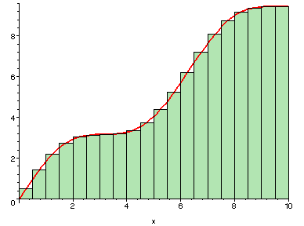
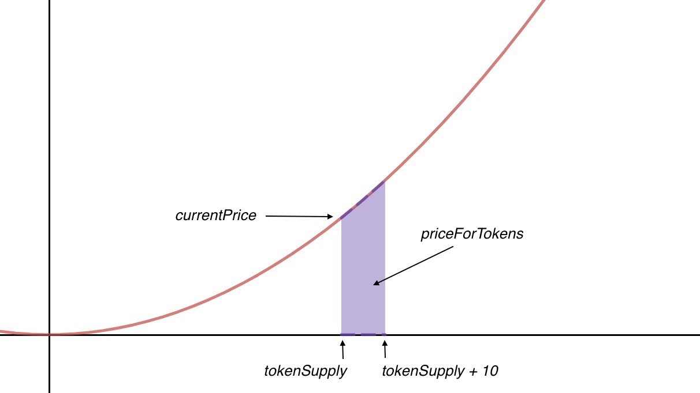
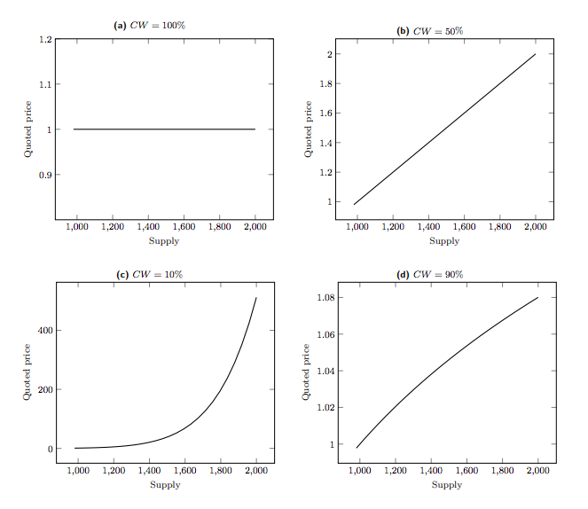
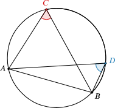

# A Technical Introduction to Bonding Curves
### For beginners

---
## Who is this for?
> An overview of the technical landscape of bonding curves, for beginners!

---
## What we're going to achieve
1. Understand the technical background, and lingo, of bonding curves (so you can speak about it with your friends).

2. See how the idea of bonding curves has evolved and been extended.

3. Gain confidence for deeper token engineering exploration.

---
## Basic Properties
* A function of token price and supply

* Always increasing (monotonic)

* Deterministic (given the same input, it will have the same output)

(We will see variations and extensions of these basic properties, but this is where it all started.)

--

---
## Misconceptions
* Bonding curves are ponzi schemes

* Bonding curves are only used for funding, exchanges, & eliminate speculation

* Uniswap is a bonding curve (kind of)

---
# Background

--
## Scarcity in the digital domain
* Blockchain enables the concept of scarcity

* Solves the double spending problem

Note:
* Becomes a source of truth, enables the concept of ownership
* Classic example: apple vs. digital image of apple

--
## Liquidity

Source: https://bitcoin.stackexchange.com

--
> The availability of liquid assets for transactions and trade.
* An order book provides liquidity; willing seller & willing buyer

--
## Price discovery

Source: https://www.ig.com/en/trading-strategies/what-is-price-discovery-and-how-does-it-work--190605

--
> The price discovery process is the process of determining the price of an asset in the marketplace through the interactions of buyers and sellers.

* Bonding curves can be a primitive price discovery mechanism

Note:
* With some price elasticity

---
# Terminology

--
## Collateral and reserve
> Collateral is the value that is provided in exchange for the token supply.

> The reserve is the pool of value backing the token supply, made up of collateral.

--
## Market cap. (market capitalization)
> Spot price multiplied by total token supply.

--
## Supply
> The tokens issued in exchange for reserve collateral.

--
Visualizing market cap and supply:

Note:
* show market cap and supply

--
## Bonding curve function
> The function describing the relationship between the token price and supply.

--
## Spot price
> The value of a single token at a point along a curve.

--

Source: https://yos.io/2018/11/10/bonding-curves/

--
## Reserve ratio
> The ratio of the token reserve to token market cap. at a point.

``$$
\text{Reserve ratio} = \frac{R}{S*P}
$$``

where R is the reserve, S is the supply, and P is the spot price.

--

Source: https://yos.io/2018/11/10/bonding-curves/

--
## Slippage & price sensitivity
> The proportionate effect of each token transaction on the spot price.
* Given a spot price and a number of tokens transacted, what is the percentage *slippage* from market value?

<!-- --
## Leverage ratio
> The ratio of market cap. and the underlying reserve collateral.
* The higher the leverage ratio, the higher the price sensitivity, and the higher the slippage.
* Inverse of reserve ratio. -->

--
## Invariant
> A mathematical property or relationship that remains constant e.g. reserve ratio.

<!-- Explore: https://www.quantamagazine.org/math-invariants-helped-lisa-piccirillo-solve-conway-knot-problem-20200602/ -->

--
## Market maker
> A mechanism or actor that creates liquidity, by providing collateral in exchange for a given token.
* Coming up: Automated Market Makers

Note:
* in the case of a traditional order book, this definition is different, and involves giving both a buy and sell price for an asset - making a profit on the spread
